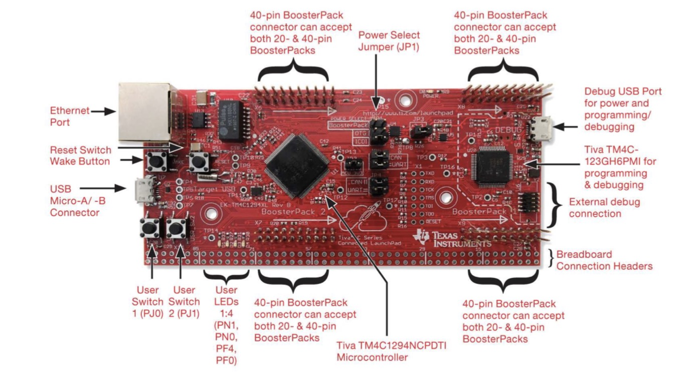
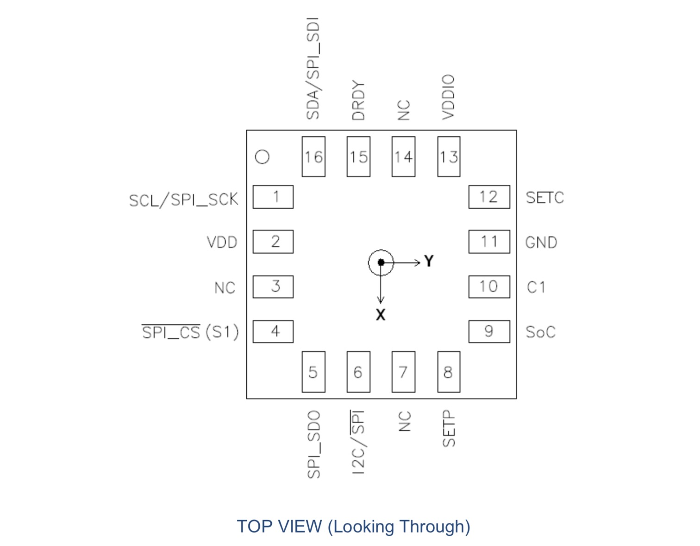
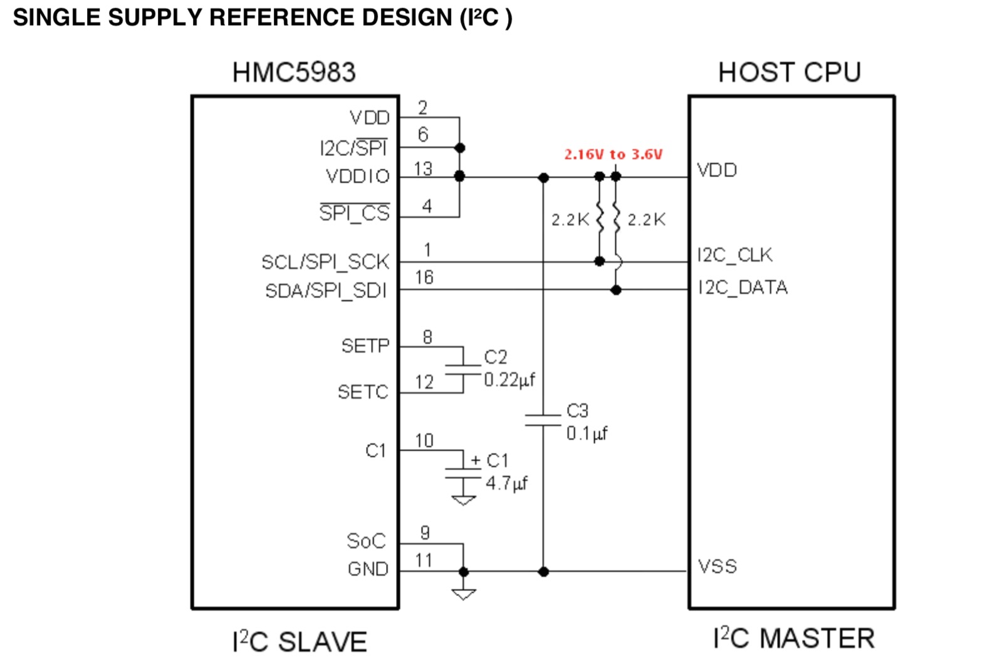
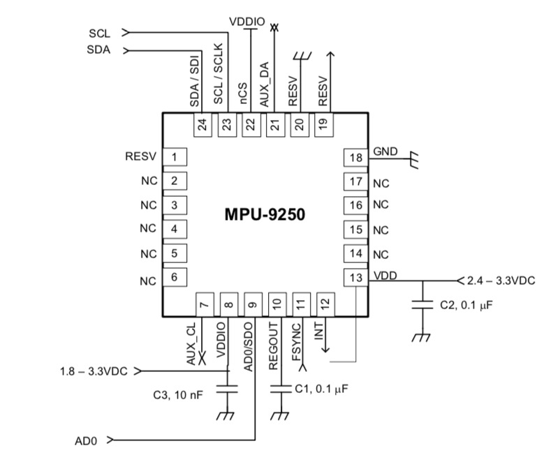
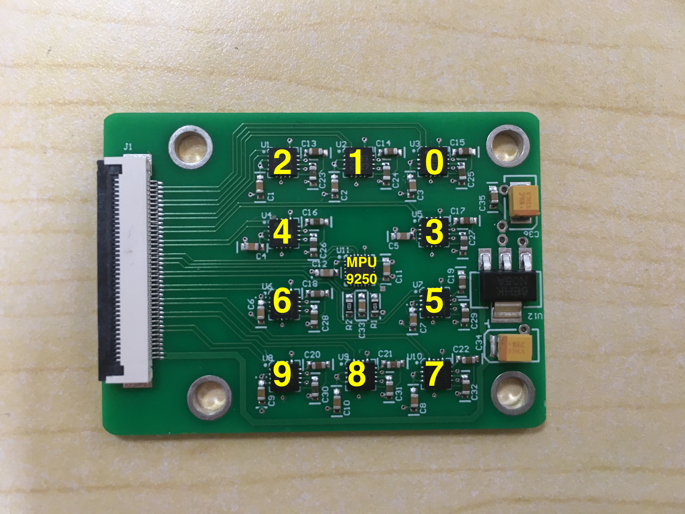
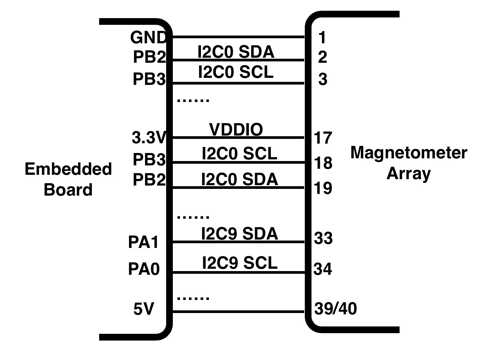
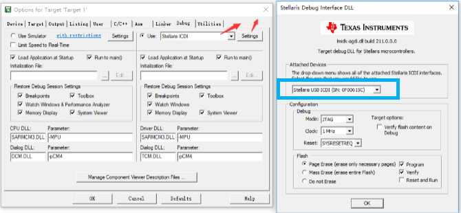

# MagWrist_Hardware

## About MagWrist
This is a project created by **QINGHAO LIU**.
The basic idea is that:

The program of the system has two parts: Hardware(Embedded Board) and Software(PC).

This README _Only_ talks about **HARDWARE** part.

## Overview

We use an embedded board to read data from magnetometer and motion-sensor chip by I2C protocol.

If you are not familiar with I2C, we strongly recommend you to learn about it.

Embedded board:__TI Cortex-M4 TM4C1294XL LaunchPad__

Magnetometer: __HMC5983__

Motion sensor: __MPU9250__

10 I2C masters are used to drive 10 magnetometers and load data from magnetometers in sequence.

One of the 10 I2C masters is also used to drive the motion sensor, since the device addresses of motion-sensor and magenetometer are different, so there is no conflict.

Then the data loaded from sensors will be transferred to __Serial Port__ by __UART__ in format.


## About TI Cortex-M4 Embedded Board



You can refer to Cortex-M4 [TM4C1294XL LaunchPad User Guide](http://www.ti.com/lit/ug/spmu365c/spmu365c.pdf)

### Map of I2C Master to pins on the embedded board

The pins on the front side is enough(**Boosterpack 1 and 2** written in white).

xxxx | Debug port | xxxx | xxxx | xxxx    
---- | ---------- | ---- | ---- | ----
3.3V | 5V |  | PF1 | GND
PE4 | GND |  | PF2 | PM3
PC4 | PE0 |  | PF3 | PH2
PC5 | PE1 |  | **PG0(I2C1 SCL)** | PH3
PC6 | PE2 |  | PL4 | ~RST 
PE5 | PE3 |  | PL5 | PD1(I2C7' SDA)
PD3(I2C8' SDA) | PD7 |  | PL0(I2C2' SDA) | PD0(I2C7' SCL)
PC7 | **PA6(I2C6 SCL)** |  | PL1(I2C2' SCL) | PN2
**PB2(I2C0 SCL)** | PM4 |  | PL2 | PN3
**PB3(I2C0 SDA)** | PM5 |  | PL3 | PP2
 ~ | ~ | ~ | ~ | ~
3.3V | 5V |  | **PG1(I2C1 SDA)** | GND
PD2(I2C8' SCL) | GND |  | **PK4(I2C3 SCL)** | PM7
PP0 | **PB4(I2C5 SCL)** |  | **PK5(I2C3 SDA)** | PP5
PP1 | **PB5(I2C5 SDA)** |  | PM0 | **PA7(I2C6 SDA)**
JP4(PD4/**PA0(I2C9 SCL)**) | PK0 |  | PM1 | ~RESET
JP5(PD5/**PA1(I2C9 SDA)**) | PK1 |  | PM2 | PQ2/**PA3(I2C8 SCL)**
PQ0 | PK2 |  | PH0 | PQ3/**PA2(I2C8 SDA)**
PP4 | PK3 |  | PH1 | PP3
**PN5(I2C2 SCL)** | **PA4(I2C7 SCL)** |  | **PK6(I2C4 SCL)** | PQ1
**PN4(I2C2 SDA)** | **PA5(I2C7 SDA)** |  | **PK7(I2C4 SDA)** | PM6


## About magnetometer HMC5983

HMC5983 is a 3-Axis magnetometer chip made by Honeywell, which is very cheap and sensitive to magnetic field.

To get started with it. The pin-map and scheme-map below may help you.





For more details, you can refer to the data sheet of HMC5983 [here](https://aerocontent.honeywell.com/aero/common/documents/myaerospacecatalog-documents/Defense_Brochures-documents/HMC5983_3_Axis_Compass_IC.pdf)


## About motion sensor  MPU9250

MPU9250 is a 6-Axis motion sensor chip made by InvenSense, which also include a magentometer.

To get started with it, the Scheme-map below may help you.



For more details, you can refer to the [product specification](https://www.invensense.com/wp-content/uploads/2015/02/PS-MPU-9250A-01-v1.1.pdf) and [Register map](http://www.invensense.com/wp-content/uploads/2017/11/RM-MPU-9250A-00-v1.6.pdf)

## Magnetometer Array

### Map of sensors on the Magnetometer Array




### Map of Pins of magnetometer array

Pins of magnetometer from up to down.

1. GND
2. Sensor-0 SDA
3. Sensor-0 SCL
4. GND
5. Sensor-1 SDA
6. Sensor-1 SCL
7. GND
8. Sensor-2 SDA
9. Sensor-2 SCL
10. GND
11. Sensor-3 SDA
12. Sensor-3 SCL
13. GND
14. Sensor-4 SDA
15. Sensor-4 SCL
16. GND
17. VDDIO of Motion Sensor(Please connect it to 3.3V)
18. Motion Sensor SCL
19. Motion Sensor SDA
20. GND
21. Sensor-5 SDA
22. Sensor-5 SCL
23. GND
24. Sensor-6 SDA
25. Sensor-6 SCL
26. GND
27. Sensor-7 SDA
28. Sensor-7 SCL
29. GND
30. Sensor-8 SDA
31. Sensor-8 SCL
32. GND
33. Sensor-9 SDA
34. Sensor-9 SCL
35. GND
36. N/A
37. N/A
38. N/A
39. 5V
40. 5V

## System Architecture

Connect 10 I2C masters to 10 magnetometers. Connect one of the 10 I2C masters to 1 motion-sensor.



## Install Keil(TI Cortex-M4 Development Environment)

Due to the problem of copyright. Ask your professor for the installation program, which may contains 5 files.

Installation program name | Details
------------------------- | -------
MDK522.EXE | The main setup file of Keil 5.22
MDKCM522.EXE | The setup file for Keil legacy devices
Keil.TM4C_DFP.1.1.0.pack | Tiva C Series device support and examples
SW-EK-TM4C1294XL-2.1.4.178.exe | Firmware development package setup
uniflash_sl.4.1.1250.exe | Uniflash setup(Maybe no use)

## Test the hardware program

1. Download this repository to your PC.
2. Find the **MagWrist_ReadData.uvprojx** file and open it with Keil.
(picture here about the postion of the src file)
3. Double click the **MagWrist_ReadData.c** file on the left side.
4. Configuration.
   1. (Read Data Rate)
   2. (Measurement Scale)
5. Click on the **Rebuild** button on the up-left side.
   1. If **0 Error(s)**, then _Congratulations!_(Ignore the warnings)
   2. If there is any error, try debug it by yourself first.
      1. Check whether there is any syntax error.(Maybe you tapped your keyboard by mistake)
      2. Right click **Target1** on the left side and choose **Options for Target 'Target 1'**.
      3. Click **Device** and check you have chosen **TM4C1294NCPDT**.
      4. Click **C/C++** and check **Include Paths**  is `.\inc;.\driverlib_`.
   3. If you have no idea, ask your professor.
6. Connect embedded board by USB and download the program into your embedded board.
7. If you have some problem with downloading, please right click on the **Target1** on the left side and click **Options for Target 'Target 1' ...**. Choose **Debug** and follow the pictures below and try again:


8. If you still have some problems, please ask your professor. :)
      
## Output format

The data loaded will be translated into ASCII and transferred to Serial Port by UART.

The format is as follows:

```
/* HMC5983 Part */
X_Axis_Data Y_Axis_Data Z_Axis_Data 0
X_Axis_Data Y_Axis_Data Z_Axis_Data 1
X_Axis_Data Y_Axis_Data Z_Axis_Data 2
X_Axis_Data Y_Axis_Data Z_Axis_Data 3
...
X_Axis_Data Y_Axis_Data Z_Axis_Data 9
/* MPU9250 Part */
Acc_X Acc_Y Acc_Z Gyr_X Gyr_Y Gyr_Z  0
```

Now you can receive data on your PC if you know how to read data from serial port of your PC.

If you have no idea, please refer to **Software** part of this project.

## Notification

The head files and functions defined except **MagWrist_ReadData.c** are provided by Prof. Wei Liu _Shanghai Jiaotong University_.

The printed circuit board(Magnetometer Array) is designed and made by Prof. Hao He _Shanghai Jiaotong University_, supported by Prof. Hongzi Zhu _Shanghai Jiaotong University_.
